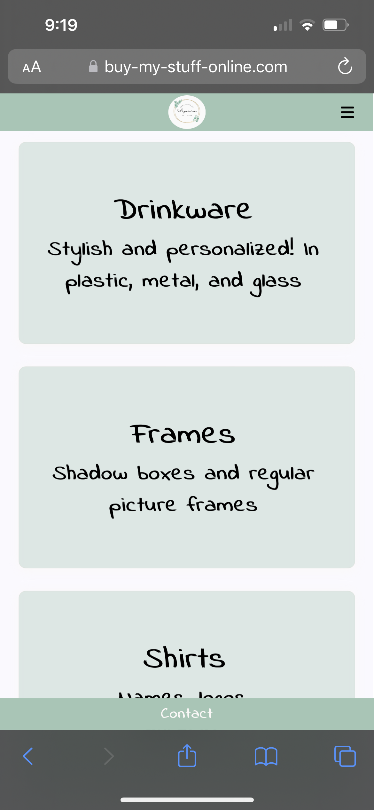
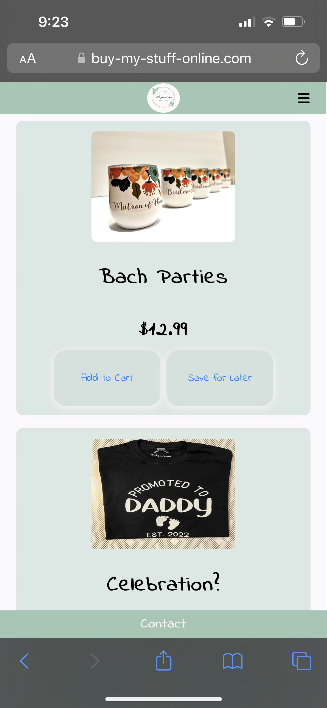
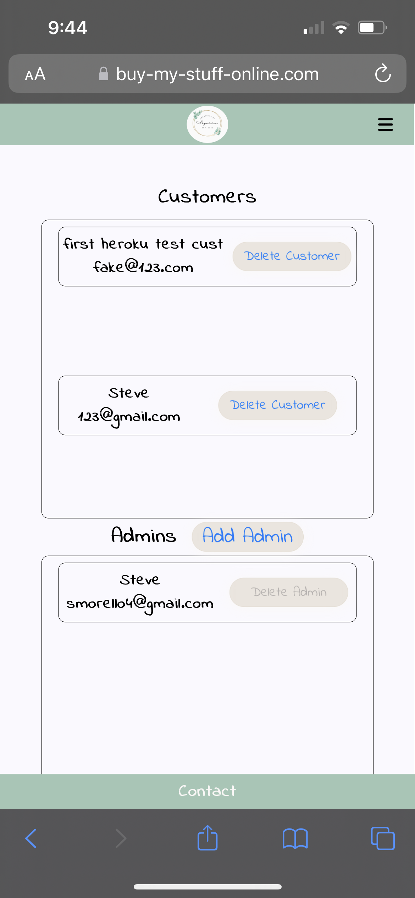

# Buy My Stuff

## Date: 09/14/2022

### By: Steve Morello

[GitHub](https://github.com/scubastove4) | [LinkedIn](https://www.linkedin.com/in/stephen-morello/) | [Trello](https://trello.com/b/ts1aBqm9/buy-my-stuff) | [Buy My Stuff](https://www.buy-my-stuff-online.com)

---

## **_Description_**

Buy My Stuff is an ecommerce site, where customers can see product categories and individual products, bookmark products, and add products to a cart, which can be sent to the site owner to order.

Admininstrators are able to add/edit/delete categories and products, as well as add/remove other administrators, remove customer accounts, and see orders.

---

## **_Technologies_**

- Vue.js
- Express
- PostgreSQL
- Node
- Email.js
- Firebase
- Multer
- Stripe API and Stripe.js
- Git/Github

---

## **_Getting Started_**

### Package installations:

- Fork and clone the repository
- Run npm i from the project route directory to initialize node modules
- cd into client directory and run npm i

### Environment Variables:

To use Email.js you will need a service ID, template ID, and public key, which can be generated by signing up for an account:

- [Sign Up](https://dashboard.emailjs.com/sign-up)

To use Stripe you will need a secret key for the backend, and a publishable key for the frontend. You can get those by signing up for an account here:

- [Sign Up](https://dashboard.stripe.com/register)
- Additional resources in Credits and Docs

To use Firebase you will need a private key, client email, project ID, and bucket name. You can get those by signing up for an account here:

- [Sign Up](https://firebase.google.com/)

To use JWT and BCrypt you will need to add your own salt rounds and secret wword.

## **_Screenshots_**

### Home Page

### Items

### Administrator's User Panel

## **_Task List(s)_**

- Future Updates

  - [ ] Responsive styling for desktop/screens larger than phone
  - [ ] Admin add items from category details page
  - [ ] Incorporate other forms of payment (CashApp, PayPal)
  - [ ] Include subscription services
  - [ ] Allow customers to enter specific order details
  - [ ] Send receipts when payments go through
  - [ ] Delete or archive completed orders

- Completed updates

  - [x] Incorporate Stripe payments
  - [x] Responsive styling for mobile device

## **_Credits and Docs_**

- Stripe with Vue: [Program With Erik](https://youtu.be/NqGEMYz89HY)
- Stripe: [Stripe API](https://stripe.com/docs/api) | [Stripe.js](https://stripe.com/docs/js)
- Responsive Navbar: [John Komarnicki Youtube](https://youtu.be/u2AwJAFeaKc)
- Navbar Icon: [Font Awesome](https://fontawesome.com/icons/bars?s=solid&f=classic)
- Google Fonts: [Indie Flower](https://fonts.google.com/specimen/Indie+Flower)
- Glassmorphism Effect: [css.glass](https://css.glass/)
- Multer: [multer](https://www.npmjs.com/package/multer) | [multer-firebase-storage](https://www.npmjs.com/package/multer-firebase-storage)
- Emailjs: [Sending Emails with ReactJS](https://mailtrap.io/blog/react-send-email/)
